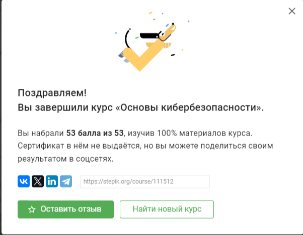

Были изучены и пройдены тесты на темы:

1. Безопасность в сети:
    1. Как работает интернет: базовые сетевые протоколы
    2. Персонализация сети
    3. Браузер TOR. Анонимизация
    4. Беспроводные сети Wi-fi
    
    
2. Защита ПК/телефона
    1. Шифрование диска
    2. Пароли
    3. Фишинг
    4. Вирусы. Примеры
    5. Безопасность мессенджеров
    
3.  Криптография на практике
    1. Введение в криптографию
    2. Цифровая подпись
    3. Электронные платежи
    4. Блокчейн

Сертификат (рис. [-@fig:001])

{#fig:001 width=70%}

